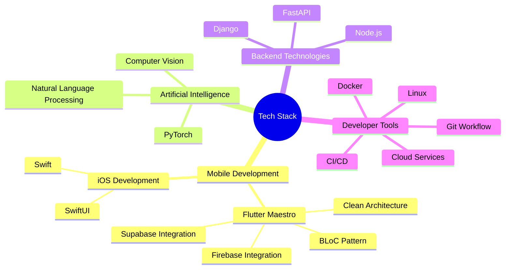

<div align="center">


[](https://git.io/typing-svg)
</div>

<div align="center">
  
</div>

## `$ whoami`

```python
class CodeAlchemist:
    def __init__(self):
        self.name = "Shishir Rijal"
        self.title = "Mobile Developer & AI Enthusiast"
        self.location = "Pokhara, Nepal 🏔️"
        self.website = "https://shishirrijal.com.np"

    @property
    def current_focus(self):
        return [
            "Building scalable mobile applications",
            "Exploring AI/ML",
            "Leading tech communities",
            "Mentoring aspiring developers"
        ]

    @property
    def working_with(self):
        return {
            "mobile": ["Flutter", "Swift", "SwiftUI"],
            "backend": ["Django", "FastAPI", "Node.js"],
            "ai_ml": ["TensorFlow", "PyTorch", "Scikit-learn"],
            "architecture": ["Clean Architecture", "MVVM", "BLoC Pattern"]
        }
```


## Tech Stack

<div align="center">
  

</div>

## Featured Projects
<div align="center">
  
<table>
  <tr>
    <td width="50%">
      <h3>Netflix Clone | SwiftUI</h3>
      <a href="https://github.com/ShishirRijal/Netflix-Clone-SwiftUI">
        
      </a>
      <p>SwiftUI • iOS • TMDB API</p>
    </td>
    <td width="50%">
      <h3>Katha - Medium Clone with SwiftUI</h3>
      <a href="https://github.com/ShishirRijal/Katha">
        
      </a>
      <p>SwiftUI • Firebase • CoreData</p>
    </td>
  </tr>
  <tr>
    <td width="50%">
      <h3>Resume Parser</h3>
      <a href="https://github.com/ShishirRijal/Resume-Parser">
        
      </a>
      <p>Python • NLP • Streamlit</p>
    </td>
    <td width="50%">
      <h3>Emotion Detection</h3>
      <a href="https://github.com/ShishirRijal/Emotion_Detection">
        
      </a>
      <p>Python • CNN • Deep Learning</p>
    </td>
  </tr>
  <tr>
    <td width="50%">
      <h3>Hack and Hunt</h3>
      <a href="https://github.com/ShishirRijal/treasurehunt-app">
        
      </a>
      <p>Flutter • Django • Firebase</p>
      <p><a href="https://github.com/ShishirRijal/hackandhunt-api">Backend Code (API)→</a></p>
    </td>
    <td width="50%">
      <h3>BloodBond</h3>
      <a href="https://github.com/ShishirRijal/BloodBond-Frontend">
        
      </a>
      <p>Flutter • FastAPI • Mobile</p>
      <p><a href="https://github.com/ShishirRijal/BloodBond-Backend">Backend Code (API)→</a></p>
    </td>
  </tr>
  <tr>
    <td width="50%">
      <h3>Budget Tracker</h3>
      <a href="https://github.com/ShishirRijal/expense_tracker">
        
      </a>
      <p>Flutter • Hive • Provider</p>
    </td>
    <td width="50%">
      <h3>Quiz App</h3>
      <a href="https://github.com/ShishirRijal/Quiz-App">
        
      </a>
      <p>Flutter • Firebase • Auth • Dark Theme</p>
    </td>
  </tr>
</table>

</div>


## Coding Stats

<div align="center">

<!--START_SECTION:waka-->
```text
Flutter █████████▒░░░░░░░░░░░ 37.20 %
Python ███████▓░░░░░░░░░░░░░ 30.10 %
C++ ██████░░░░░░░░░░░░░░░ 25.40 %
SwiftUI ████░░░░░░░░░░░░░░░░░ 15.30 %
```
<!--END_SECTION:waka-->

</div>

## Community Impact

<div align="center">

| <span style="color:#4CAF50">Role</span> | <span style="color:#FF9800">Organization</span> | <span style="color:#2196F3">Impact</span> |
|-----------------|-------------------|---------|
| <span style="color:#4CAF50">President</span> | <span style="color:#FF9800">i-CES</span> | Led community of 20+ members, Conducted 25+ programs, 100+ mentored students |
| <span style="color:#4CAF50">MLSA</span> | <span style="color:#FF9800">Microsoft</span> | Cloud & AI workshops, developer community growth |
| <span style="color:#4CAF50">Organizer</span> | <span style="color:#FF9800">EthosHack</span> | 24-hour regional hackathon |
| <span style="color:#4CAF50">Organizer</span> | <span style="color:#FF9800">TechParva</span> | Event featuring Code with Coffee, Datathon, Design Incubation, Capture the Flag |
| <span style="color:#4CAF50">Organizer</span> | <span style="color:#FF9800">AI Bootcamp</span> | Year-long ML mentorship program |
| <span style="color:#4CAF50">Organizer & Mentor (Flutter)</span> | <span style="color:#FF9800">Call For Enthusiast</span> | Month long mentorship program |


</div>


## Contribution Graph

<div align="center">

[](https://github.com/ashutosh00710/github-readme-activity-graph)

<p align="center">
  
  
</p>

</div>

## Certifications & Achievements

<div align="center">

[](https://www.udemy.com/certificate/UC-681a51c4-1d17-464b-994c-6adbe24e582a/)
[](https://www.coursera.org/account/accomplishments/specialization/CT67SJQJPHQQ)
[](https://linkedin.com)

</div>

## Technologies & Tools

<div align="center">

### Languages & Frameworks
[](https://skillicons.dev)

### Tools & Platforms
[](https://skillicons.dev)

</div>

## Connect With Me

<div align="center">

<a href="https://shishirrijal.com.np">
  
</a>
<a href="https://linkedin.com/in/shishirrijal">
  
</a>
<a href="mailto:ccrrizal@gmail.com">
  
</a>

</div>

<div align="center">

## ⚡ Fun Facts

```javascript
// Life of a developer
while (isCoding) {
    if (coffee.isEmpty()) {
        coffee.refill();
        brain.recharge();
    }
    if (bug.found()) {
        if (deepseek.hasAnswer()) {
            bug.fix();
            happiness++;
        } else if (stackoverflow.hasAnswer()) {
            bug.fix();
            happiness++;
        } else {
            coffee.drink();
            debug.harder();
        }
    }
    code.write();
    knowledge.expand();
}
```

</div>

---

<div align="center">


*"Building tomorrow's solutions, one line of code at a time."*

</div>
