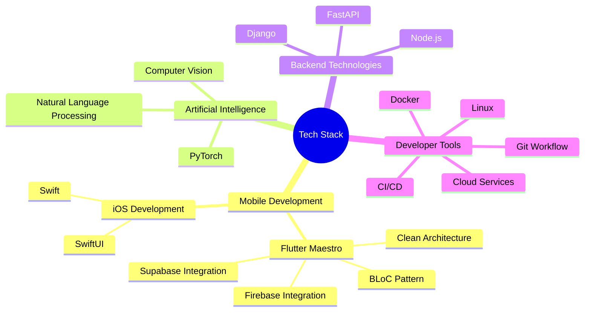

<div align="center">


[](https://git.io/typing-svg)
</div>

<div align="center">
  
</div>

## `$ whoami`

```python
class CodeAlchemist:
    def __init__(self):
        self.name = "Shishir Rijal"
        self.title = "Mobile Developer & AI Enthusiast"
        self.location = "Pokhara, Nepal 🏔️"
        self.website = "https://shishirrijal.com.np"

    @property
    def current_focus(self):
        return [
            "Building scalable mobile applications",
            "Exploring AI/ML",
            "Leading tech communities",
            "Mentoring aspiring developers"
        ]

    @property
    def working_with(self):
        return {
            "mobile": ["Flutter", "Swift", "SwiftUI"],
            "backend": ["Django", "FastAPI", "Node.js"],
            "ai_ml": ["TensorFlow", "PyTorch", "Scikit-learn"],
            "architecture": ["Clean Architecture", "MVVM", "BLoC Pattern"]
        }
```

<div align="center">

## Tech Stack



</div>

## Featured Projects

<div align="center">

  <table>
    <tr>
      <td width="45%" style="padding: 20px; text-align: center; background: #f3f4f6; border-radius: 10px; box-shadow: 0 2px 10px rgba(0, 0, 0, 0.1);">
        <h3 style="color: #007bff;">ShopSphere</h3>
        <a href="https://github.com/ShishirRijal/ShopSphere" target="_blank">
          
        </a>
        <p>
          <a href="https://github.com/ShishirRijal/ShopSphere" target="_blank">
            
          </a>
        </p>
        <p><strong>Flutter, Firebase, Clean Architecture</strong> - A full-featured eCommerce platform with clean architecture implementation.</p>
      </td>
      <td width="45%" style="padding: 20px; text-align: center; background: #f3f4f6; border-radius: 10px; box-shadow: 0 2px 10px rgba(0, 0, 0, 0.1);">
        <h3 style="color: #28a745;">Zero Waste Kitchen</h3>
        <a href="https://github.com/ShishirRijal/Zero-Waste-Kitchen-Flutter" target="_blank">
          
        </a>
        <p>
          <a href="https://github.com/ShishirRijal/Zero-Waste-Kitchen-Flutter" target="_blank">
            
          </a>
        </p>
        <p><strong>Flutter, Firebase, Provider</strong> - Social impact platform connecting food donors with those in need.</p>
      </td>
    </tr>
  </table>

</div>


## Coding Stats

<div align="center">

<!--START_SECTION:waka-->
```text
Flutter █████████▒░░░░░░░░░░░ 37.20 %
Python ███████▓░░░░░░░░░░░░░ 30.10 %
C++ ██████░░░░░░░░░░░░░░░ 25.40 %
SwiftUI ████░░░░░░░░░░░░░░░░░ 15.30 %
```
<!--END_SECTION:waka-->

</div>

## Community Impact

<div align="center">

| Role | Organization | Impact |
|------|-------------|---------|
| President | i-CES | Led community of 20+ members, Conducted 25+ programs, 100+ mentored students |
| MLSA | Microsoft | Cloud & AI workshops, developer community growth |
| Organizer | EthosHack | 24-hour regional hackathon |
| Organizer | TechParva | Event featuring Code with Coffee, Datathon, Design Incubation, Capture the Flag |
| Organizer | AI Bootcamp | Year-long ML mentorship program |
| Organizer & Mentor (Flutter) | Call For Enthusiast | Month long mentorship program|

</div>


## Contribution Graph

<div align="center">

[](https://github.com/ashutosh00710/github-readme-activity-graph)

<p align="center">
  
  
</p>

</div>

## Certifications & Achievements

<div align="center">

[](https://www.udemy.com/certificate/UC-681a51c4-1d17-464b-994c-6adbe24e582a/)
[](https://www.coursera.org/account/accomplishments/specialization/CT67SJQJPHQQ)
[](https://linkedin.com)

</div>

## Technologies & Tools

<div align="center">

### Languages & Frameworks
[](https://skillicons.dev)

### Tools & Platforms
[](https://skillicons.dev)

</div>

## Connect With Me

<div align="center">

<a href="https://shishirrijal.com.np">
  
</a>
<a href="https://linkedin.com/in/shishirrijal">
  
</a>
<a href="mailto:ccrrizal@gmail.com">
  
</a>

</div>

<div align="center">

## ⚡ Fun Facts

```javascript
// Life of a developer
while (isCoding) {
    if (coffee.isEmpty()) {
        coffee.refill();
        brain.recharge();
    }
    if (bug.found()) {
        if (deepseek.hasAnswer()) {
            bug.fix();
            happiness++;
        } else if (stackoverflow.hasAnswer()) {
            bug.fix();
            happiness++;
        } else {
            coffee.drink();
            debug.harder();
        }
    }
    code.write();
    knowledge.expand();
}
```

</div>

---

<div align="center">


*"Building tomorrow's solutions, one line of code at a time."*

</div>
