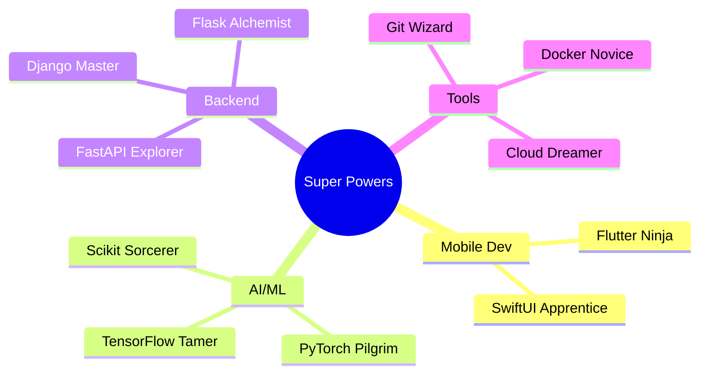

 
<div align="center">
  
[+%7B+code()+%7D;git+push+origin+main;function+brain()+%7B+return+caffeine+%7D;)](https://git.io/typing-svg)

</div>

## `whoami`


A passionate tech enthusiast from the enchanting landscapes of Nepal, where the mountains inspire me to reach new heights in technology. Currently pursuing Computer Engineering at IOE Paschimanchal Campus, I'm on an exciting journey exploring the bits and bytes of this binary world. From mobile app development to machine learning, I love diving into new technologies and bringing ideas to life through code.

```python
class ShishirTheEngineer:
    def __init__(self):
        self.name = "Shishir Rijal"
        self.location = "Pokhara, Nepal 🏔️"
        self.coffee_level = "Infinity☕"
        self.current_status = "Converting caffeine to code"
        self.education = "Computer Engineering @ IOE"
        
    def daily_routine(self):
        while not sleeping:
            coffee.drink()
            if self.coffee_level < 3:
                coffee.refill()
            try:
                code.write()
            except Errors as e:
                stackoverflow.copy_paste(e)
            finally:
                git.push("origin", "main")
                
    def get_programming_philosophy(self):
        return "If it works on my machine, that's good enough! 🚀"
```


## Skills & Powers

<div align="center">



</div>


## Project Galaxies

### Mobile Development Universe
<div align="center">
  
[](https://github.com/ShishirRijal/iDo-SwiftUI)
[]([https://github.com/ShishirRijal/Flutter-News-App](https://github.com/ShishirRijal/treasurehunt-app))

</div>

### Machine Learning Dimension
<div align="center">
  
[](https://github.com/ShishirRijal/Emotion_Detection)
[](https://github.com/ShishirRijal/Spam-SMS-Classification)

</div>


## 💭 Random Developer Quotes

```javascript
// Life of a programmer
if (brain.isEmpty()) {
    coffee.drink();
    brain.recharge();
    keepCoding();
} else {
    while (coffee.exists()) {
        code.write();
        bugs.fix();
    }
}
```


## My Programming Multiverse

<div align="center">

```text
Mobile Dev    ███████████████░░░░   75%
Machine Learning █████████░░░░░░░░   45%
Backend      ████████░░░░░░░░░░░   40%
Coffee Level ████████████████████  100%
Bug Fixing   ██████████████████░░   90%
```

*When I'm not coding, I'm probably:*
- ☕ Refilling my coffee mug for the 17th time
- 💭 Debugging in my dreams
- 🎮 Gaming to refresh my brain cache
- 🤔 Contemplating why my code works

</div>

## 🎵 Developer's Playlist

```sql
SELECT * FROM life 
WHERE coding = true 
  AND coffee_level > 0 
  AND bugs = 0 
ORDER BY happiness DESC;
```

## GitHub Statistics

<div align="center">

[](https://github.com/ashutosh00710/github-readme-activity-graph)

<p align="center">
  
  
</p>


</div>

## Certifications

<div align="center">

[](https://www.yourlink.com)
[](https://www.yourlink.com)
[](https://www.yourlink.com)
[](https://www.yourlink.com)
[](https://www.yourlink.com)

</div>

## 🛠️ Tech Stack

<div align="center">

### Languages & Frameworks
[](https://skillicons.dev)

### 🔧 Tools & Technologies
[](https://skillicons.dev)

### 📚 Currently Learning
[](https://skillicons.dev)

</div>

## Let's Connect!

<div align="center">

[](mailto:shishir.772417@pasc.tu.edu.np)
[](https://www.linkedin.com/in/shishirrijal)
[](https://github.com/ShishirRijal)

</div>

---

<div align="center">


*"Code is poetry written in caffeine"* ☕️

</div>
